<div align="center">

<!-- ANIMATED SVG BANNER — renders directly in GitHub README -->


<br/>

<!-- LIVE 3D INTERACTIVE DEMO BADGE -->
<a href="https://kushalcodezz.github.io/AgentMesh/">
  
</a>
&nbsp;
<a href="https://github.com/KushalCodezz/AgentMesh/blob/main/docs/index.html">
  
</a>

<br/><br/>

[](./orchestrator/tests)
[](https://python.org)
[](https://fastapi.tiangolo.com)
[](https://nextjs.org)
[](./docker-compose.yml)
[](./.github/workflows/ci.yml)
[](./LICENSE)

[**Quick Start**](#-quick-start) · [**Architecture**](#architecture) · [**Agents**](#agents) · [**API**](#api-reference) · [**Dashboard**](#dashboard) · [**Deployment**](#deployment)

> **Enable GitHub Pages** → repo Settings → Pages → Source: `Deploy from branch` → Branch: `main` → Folder: `/docs`
> Then the full interactive 3D demo is live at `https://kushalcodezz.github.io/AgentMesh/`

</div>

---

## What Is This?

AgentMesh is a **production-ready multi-agent orchestration platform** that coordinates specialist AI agents — researcher, architect, engineer, QA, and creative — to produce complete, verifiable deliverables from a single natural language request.

> *"Research the AI tutoring market in India, design an MVP architecture, build a sample auth service with tests, and create a promo video brief."*
>
> **→ AgentMesh dispatches agents in parallel, debates high-impact outputs, cross-validates everything, and returns a packaged deliverable with provenance on every claim.**

### Key Capabilities

| | Feature | Detail |
|---|---|---|
| 🧠 | **Task DAG Planner** | Claude converts user intent into a dependency graph of subtasks |
| ⚔️ | **Debate Engine** | PROPOSE → CRITIQUE → RESPOND → AGGREGATE with confidence scoring |
| 🔄 | **Adaptive Layer** | Detects recurring capability gaps, proposes and deploys new agents |
| 🔍 | **Shared Memory** | ChromaDB vector store — every agent reads and writes evidence |
| 📦 | **Provenance** | Every artifact has a chain of refs back to source URLs |
| 🛡️ | **Cross-Validation** | Every primary output verified by at least one other agent |
| 📡 | **Real-Time Events** | WebSocket stream — watch agents work live in the dashboard |
| 🖥️ | **Admin Dashboard** | Next.js 14 — trace viewer, agent registry, human-ops approvals |

---

## Architecture

```
┌─────────────────────────────────────────────────────────────────┐
│                        USER / UI                                │
└───────────────────────────────┬─────────────────────────────────┘
                                │  POST /api/v1/conversations
                                ▼
┌─────────────────────────────────────────────────────────────────┐
│                  API GATEWAY  (FastAPI + WebSocket)             │
└───────────────────────────────┬─────────────────────────────────┘
                                │
                                ▼
┌─────────────────────────────────────────────────────────────────┐
│                     ORCHESTRATOR CORE                           │
│                                                                 │
│  ┌───────────────┐  ┌────────────────┐  ┌──────────────────┐  │
│  │  Task Planner │  │  Debate Engine │  │  Adaptive Layer  │  │
│  │  (DAG builder)│  │  PROPOSE→AGG   │  │  Gap detect      │  │
│  └───────────────┘  └────────────────┘  └──────────────────┘  │
└──────────────────────────────┬──────────────────────────────────┘
                               │
              ┌────────────────┼────────────────┐
              │                │                │
    ┌─────────▼──┐  ┌──────────▼─┐  ┌──────────▼─┐
    │  Product   │  │  Architect │  │  Engineer  │
    │  Manager   │  │   Agent    │  │   Agent    │
    │  (Claude)  │  │  (Claude)  │  │  (Claude)  │
    └────────────┘  └────────────┘  └────────────┘
              │                │                │
    ┌─────────▼──┐  ┌──────────▼─┐             │
    │    QA      │  │  Creative  │             │
    │   Agent    │  │   Agent    │             │
    │  (Claude)  │  │  (Gemini)  │             │
    └────────────┘  └────────────┘             │
                                               │
    ──────────────────────────────────────────────
                        SHARED STORAGE
    ┌────────────┐    ┌────────────┐    ┌──────────┐
    │  ChromaDB  │    │  S3/MinIO  │    │ Postgres │
    │ (vectors)  │    │(artifacts) │    │(metadata)│
    └────────────┘    └────────────┘    └──────────┘
```

---

## Full Request Lifecycle

```
User submits request
        │
        ▼
┌───────────────────────────────────────────────┐
│  STEP 1 · PLAN                                │
│                                               │
│  TaskPlanner (Claude Opus) converts           │
│  natural language → TaskSpec DAG:             │
│                                               │
│  t1: research ──────────────────────┐         │
│  t2: architecture  (depends: t1) ───┤         │
│  t3: code          (depends: t2) ───┤         │
│  t4: qa            (depends: t3) ───┘         │
│  t5: creative ── runs in parallel             │
└──────────────────────┬────────────────────────┘
                       │
                       ▼
┌───────────────────────────────────────────────┐
│  STEP 2 · DISPATCH                            │
│                                               │
│  Parallel: t1 (research) + t5 (creative)      │
│  Sequential: t2 → t3 → t4                     │
│  Each task receives prior refs as context     │
└──────────────────────┬────────────────────────┘
                       │
                       ▼
┌───────────────────────────────────────────────┐
│  STEP 3 · DEBATE  (high-impact tasks only)    │
│                                               │
│  PROPOSE  Agent submits output + evidence     │
│  CRITIQUE QA + peer agents review             │
│  RESPOND  Agent can revise                    │
│                                               │
│  score ≥ 0.75  ──► ACCEPT ✓                  │
│  score ≥ 0.60  ──► NEXT ROUND (max 3)        │
│  score < 0.60  ──► HUMAN REVIEW 🔴           │
└──────────────────────┬────────────────────────┘
                       │
                       ▼
┌───────────────────────────────────────────────┐
│  STEP 4 · ADAPTIVE ANALYSIS                   │
│                                               │
│  failures > 8 AND avg_confidence < 0.60?      │
│  YES → design new AgentSpec via Claude        │
│       → run sandbox tests                     │
│       → low-impact: auto-register             │
│       → high-impact: human_ops_review=true    │
└──────────────────────┬────────────────────────┘
                       │
                       ▼
┌───────────────────────────────────────────────┐
│  STEP 5 · DELIVER                             │
│                                               │
│  summary, task_results, all_refs,             │
│  avg_confidence, requires_human_review,       │
│  assembled_at                                 │
└───────────────────────────────────────────────┘
```

---

## Agents

| Agent | Capability | Model | Outputs |
|---|---|---|---|
| **ProductManagerAgent** | `research` `planning` | Claude Opus | PRD, market analysis, competitor matrix, feature backlog |
| **ArchitectAgent** | `architecture` | Claude Opus | ASCII diagram, API contracts, data model, cost estimates |
| **EngineerAgent** | `code` | Claude Opus | Source files, tests, Dockerfile, syntax-validated |
| **QAAgent** | `qa` | Claude Sonnet | Check report with pass/fail/warn per item |
| **CreativeAgent** | `creative` | Claude Sonnet / Gemini | Image prompts, video storyboard, marketing copy |
| **AdaptiveAgentCreator** | `adaptive` | Claude Sonnet | Agent spec, sandbox tests, deployment proposal |

### Message Envelope Schema

```json
{
  "message_id":       "uuid",
  "conversation_id":  "uuid",
  "from_agent":       "orchestrator",
  "to_agent":         "engineer_agent",
  "type":             "task",
  "payload":          { "...task-specific content..." },
  "refs": [
    { "ref_type": "vector", "ref_id": "abc123", "description": "Research output" }
  ],
  "meta": { "priority": 80, "budget_tokens": 4000, "requires_debate": true }
}
```

---

## Quick Start

### Prerequisites

- Docker Desktop ≥ 4.x
- `ANTHROPIC_API_KEY` (required)
- `DEEPSEEK_API_KEY` and `GEMINI_API_KEY` (optional)

### 1. Clone and Configure

```bash
git clone https://github.com/KushalCodezz/AgentMesh.git
cd AgentMesh
cp .env.example .env
# edit .env → add ANTHROPIC_API_KEY
```

### 2. Start Everything

```bash
docker compose up
```

| Service | URL | Purpose |
|---|---|---|
| **Orchestrator** | `localhost:8000` | FastAPI backend + WebSocket |
| **Dashboard** | `localhost:3000` | Next.js admin UI |
| **API Docs** | `localhost:8000/docs` | Swagger UI |
| **MinIO** | `localhost:9001` | Artifact browser |
| **Jaeger** | `localhost:16686` | Distributed traces |

### 3. Submit a Request

```bash
curl -X POST http://localhost:8000/api/v1/conversations \
  -H "Content-Type: application/json" \
  -d '{
    "request": "Research the AI coding assistant market and design a SaaS MVP architecture"
  }'
```

### 4. Run the Demo Script

```bash
python scripts/demo.py
```

---

## Dashboard

- **Conversations** — submit requests, watch Task DAG populate, stream live events, view deliverable
- **Agent Registry** — live reliability scores, success rates, latency per agent
- **Adaptive Layer** — review capability gap proposals, approve or reject new agent deployments

---

## API Reference

```
POST   /api/v1/conversations              Submit a new request
GET    /api/v1/conversations/{id}         Get full state + results
GET    /api/v1/conversations/{id}/deliverable  Get packaged output
WS     /ws/{id}                           Stream live agent events
GET    /api/v1/agents                     List agents + reliability stats
GET    /api/v1/adaptive/proposals         List gap proposals
POST   /api/v1/adaptive/proposals/{id}    Approve or reject
GET    /api/v1/stats                      System-wide stats
GET    /health                            Health check
```

---

## Configuration

| Variable | Default | Description |
|---|---|---|
| `ANTHROPIC_API_KEY` | — | **Required** |
| `DEEPSEEK_API_KEY` | — | Research agent (optional) |
| `GEMINI_API_KEY` | — | Creative agent (optional) |
| `CONFIDENCE_THRESHOLD` | `0.75` | Debate accept threshold |
| `ESCALATION_THRESHOLD` | `0.60` | Below this → human review |
| `MAX_DEBATE_ROUNDS` | `3` | Max rounds per debate |
| `TASK_BUDGET_TOKENS` | `4000` | Token budget per task |
| `ADAPTIVE_FAILURE_THRESHOLD` | `8` | Failures before gap proposal |

---

## Tests

```bash
cd orchestrator
pytest tests/ -v          # all 29 tests
pytest tests/ --cov=.     # with coverage
```

**Status: 29/29 passing ✅**

---

## Deployment

### Kubernetes

```bash
kubectl create namespace agentmesh
kubectl create secret generic agentmesh-secrets \
  --from-literal=ANTHROPIC_API_KEY=sk-ant-... \
  -n agentmesh
kubectl apply -f infra/k8s/deployment.yaml -n agentmesh
```

### CI/CD (GitHub Actions)

```
push to main → test-backend + test-frontend → build + push to GHCR
```

---

## Project Structure

```
AgentMesh/
├── orchestrator/
│   ├── core/           envelope · planner · debate · adaptive · orchestrator
│   ├── agents/         base · product_manager · architect · engineer · qa · creative
│   ├── adapters/       Claude / DeepSeek / Gemini / OpenAI
│   ├── storage/        ChromaDB · S3/MinIO
│   ├── tests/          29 tests passing
│   └── main.py         FastAPI app + WebSocket
├── frontend/           Next.js 14 dashboard
├── infra/              PostgreSQL schema · Kubernetes manifests
├── docs/
│   ├── index.html      Interactive 3D platform demo (GitHub Pages)
│   └── banner.svg      Animated README banner
├── scripts/            setup · demo · push
├── .github/workflows/  CI/CD pipeline
└── docker-compose.yml
```

---

## Roadmap

- [x] Core orchestrator + Task DAG planner
- [x] 5 specialist agents (ProductManager, Architect, Engineer, QA, Creative)
- [x] Debate engine with reliability scoring
- [x] Adaptive agent creator with sandbox testing
- [x] ChromaDB + PostgreSQL + S3/MinIO storage
- [x] Next.js dashboard with real-time WebSocket
- [x] Docker Compose + Kubernetes + GitHub Actions CI
- [x] Interactive 3D platform demo (GitHub Pages)
- [ ] Pinecone / Weaviate production vector DB
- [ ] Full Gemini multimodal pipeline
- [ ] Multi-tenant isolation
- [ ] Slack / webhook notifications

---

## License

MIT

---

<div align="center">

Built with Claude, FastAPI, Next.js, ChromaDB, and Docker

**[⭐ Star this repo](https://github.com/KushalCodezz/AgentMesh)** if you find it useful

</div>
